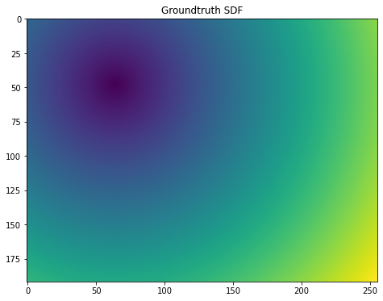
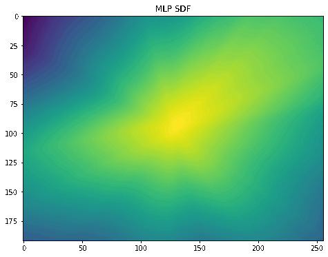
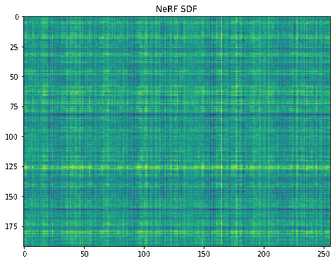
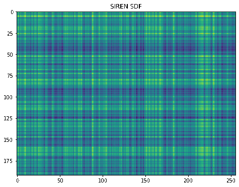
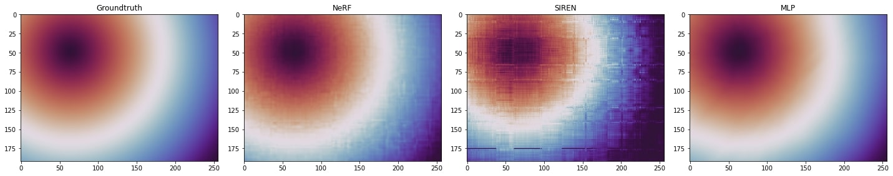

# Learning 2D SDF using approaches inspired from MLP, NeRF, SIREN
by Nail Ibrahimli


```python
import torch
import numpy as np
import matplotlib.pyplot as plt

from skimage import measure

W = 256 #width
H = 192 #height
R = 16  #radius

# Might needed to be tuned per model
Hidden = 16    # hidden layer size for the models
epoch = 2000   # epoch counts
Harmonics = 16 # for postional encoding
LR = 0.01 # learning rate
```

# SDF

Creating SDF data width of W, height of H and radius of R


```python
SDF = np.zeros((H,W))
X_train = np.zeros((W*H,2))
y_train = np.zeros((W*H))
cx = W/2
cy = H/2
count = 0
for j in range(H):
    for i in range (W):
        SDF[j][i] = (np.sqrt((i-cx/2)**2+(j-cy/2)**2)-R)
        X_train[count] = np.array(((i-cx),(j-cy)))
        y_train[count] = SDF[j][i]
        count= count+1
print("How it should be, GT")
fig = plt.figure(figsize=(8,6))
plt.imshow(SDF)
plt.title("Plot 2D array")
plt.show()
```

    How it should be, GT


    

    


# Naive MLP
Let's regress it with Naive MLP


```python
class Feedforward(torch.nn.Module):
        def __init__(self,input_size, hidden_size,higher_dimension=4,):
            super().__init__()
            self.input_size = input_size
            self.hidden_size  = hidden_size
            self.higher_dimension = higher_dimension
            self.Softplus = torch.nn.Softplus(beta = 10)
            if(higher_dimension): # for fairness
                self.fc0 = torch.nn.Linear(self.input_size, higher_dimension*2*2)
                self.fc1 = torch.nn.Linear(self.higher_dimension*2*2, self.hidden_size)
            else:
                self.fc1 = torch.nn.Linear(self.input_size, self.hidden_size)
            self.fc2 = torch.nn.Linear(self.hidden_size, self.hidden_size)
            self.fc3 = torch.nn.Linear(self.hidden_size, self.hidden_size)
            self.fc4 = torch.nn.Linear(self.hidden_size, self.hidden_size)
            self.fc5 = torch.nn.Linear(self.hidden_size, self.hidden_size)
            self.fc6 = torch.nn.Linear(self.hidden_size, self.hidden_size)
            self.fc7 = torch.nn.Linear(self.hidden_size, self.hidden_size)
            self.fc8 = torch.nn.Linear(self.hidden_size, 1)
        def forward(self, x):
            if(self.higher_dimension): # for fairness
                hidden = self.fc1(self.Softplus(self.fc0(x)))
            else:
                hidden = self.fc1(x)
            softplus = self.Softplus(hidden)
            softplus2 = self.Softplus(self.fc2(softplus))
            softplus3 = self.Softplus(self.fc3(softplus2))
            output = self.fc8(softplus3)
            
            #softplus4 = self.Softplus(self.fc4(softplus3))
            #softplus5 = self.Softplus(self.fc5(softplus4))
            #softplus6 = self.Softplus(self.fc6(softplus5))
            #softplus7 = self.Softplus(self.fc7(softplus6))
            return output
```


```python
modelMLP = Feedforward(2, Hidden,Harmonics)
criterion = torch.nn.HuberLoss()
optimizer = torch.optim.Adam(modelMLP.parameters(), lr = LR)
X_train = torch.FloatTensor(X_train)
y_train = torch.FloatTensor(y_train)
```


```python
modelMLP.eval()
test_list = np.random.choice(W*H, 512)
X_test = X_train[test_list]
y_test = y_train[test_list]
y_pred = modelMLP(X_test)
before_train = criterion(y_pred.squeeze(), y_test)
print('Test loss before training' , before_train.item())
```

    Test loss before training 94.08132934570312


```python
modelMLP.train()
SDFmlp = np.zeros((H,W))

for epoch in range(epoch):
    optimizer.zero_grad()
    # Forward pass
    y_pred = modelMLP(X_train)
    # Compute Loss
    loss = criterion(y_pred.squeeze(), y_train)
    if(epoch%100==0):
        print('Epoch {}: train loss: {}'.format(epoch, loss.item()))
        count =0
        for j in range(H):
            for i in range (W):
                SDFmlp[j][i] = y_pred[count]
                count= count+1
        fig = plt.figure(figsize=(8,6))
        plt.imshow(SDFmlp)
        plt.title("Plot 2D array")
        plt.show()
    # Backward pass
    loss.backward()
    optimizer.step()
```





    

    


# Harmonical embedding
I think it is better to think about it as a harmonical embedding than Positional Encoding,


```python
class HarmonicEmbedding(torch.nn.Module):
    def __init__(self, n_harmonic_functions=3, omega0=0.1):
        """
        I took some ideas from PyTorch3D implementation for implementing this
            embedding[..., i*dim:(i+1)*dim] = [
                sin(x[..., i]),
                sin(2*x[..., i]),
                sin(4*x[..., i]),
                ...
                sin(2**(self.n_harmonic_functions-1) * x[..., i]),
                cos(x[..., i]),
                cos(2*x[..., i]),
                cos(4*x[..., i]),
                ...
                cos(2**(self.n_harmonic_functions-1) * x[..., i])
            ]
            
        Note that `x` is also premultiplied by `omega0` before
        evaluating the harmonic functions.
        Personally i would like to think omega0 as scaling factor.
        """
        super().__init__()
        self.register_buffer(
            'frequencies',
            omega0 * (2.0 ** torch.arange(n_harmonic_functions)),
        )
    def forward(self, x):
        """
        Args:
            x: tensor of shape [..., dim]
        Returns:
            embedding: a harmonic embedding of `x`
                of shape [..., n_harmonic_functions * dim * 2]
        """
        embed = (x[..., None] * self.frequencies).view(*x.shape[:-1], -1)
        return torch.cat((embed.sin(), embed.cos()), dim=-1)
```

# Naive Nerf
Naive Nerf implementation with harmonical embeddings


```python
class FeedforwardNeRF(torch.nn.Module): 
        #For 2D SDF regression, with out any Radiance Fields of course
        def __init__(self,n_harmonic_functions, input_size, hidden_size):
            super().__init__()
            self.harmonic_embedding = HarmonicEmbedding(n_harmonic_functions)
            self.input_size = n_harmonic_functions * 2 *2
            self.hidden_size  = hidden_size
            self.Softplus = torch.nn.Softplus(beta = 10)
            self.fc1 = torch.nn.Linear(self.input_size, self.hidden_size)
            self.fc2 = torch.nn.Linear(self.hidden_size, self.hidden_size)
            self.fc3 = torch.nn.Linear(self.hidden_size, self.hidden_size)
            self.fc4 = torch.nn.Linear(self.hidden_size, self.hidden_size)
            self.fc5 = torch.nn.Linear(self.hidden_size, self.hidden_size)
            self.fc6 = torch.nn.Linear(self.hidden_size, self.hidden_size)
            self.fc7 = torch.nn.Linear(self.hidden_size, self.hidden_size)
            self.fc8 = torch.nn.Linear(self.hidden_size, 1)
        def forward(self, x):
            x= self.harmonic_embedding(x)
            hidden = self.fc1(x)
            softplus = self.Softplus(hidden)
            softplus2 = self.Softplus(self.fc2(softplus))
            softplus3 = self.Softplus(self.fc3(softplus2))
            output = self.fc8(softplus3)
            
            #softplus4 = self.Softplus(self.fc4(softplus3))
            #softplus5 = self.Softplus(self.fc5(softplus4))
            #softplus6 = self.Softplus(self.fc6(softplus5))
            #softplus7 = self.Softplus(self.fc7(softplus6))
            
            return output
```

# Naive SIREN
Naive SIREN implementation, let all activations be sinusoidals


```python
class FeedforwardSIREN(torch.nn.Module):
        def __init__(self,n_harmonic_functions, input_size, hidden_size):
            super().__init__()
            self.harmonic_embedding = HarmonicEmbedding(n_harmonic_functions)
            self.input_size = n_harmonic_functions * 2 *2
            self.hidden_size  = hidden_size
            self.Softplus = torch.nn.Softplus(beta = 10)
            self.fc1 = torch.nn.Linear(self.input_size, self.hidden_size)
            self.fc2 = torch.nn.Linear(self.hidden_size, self.hidden_size)
            self.fc3 = torch.nn.Linear(self.hidden_size, self.hidden_size)
            self.fc4 = torch.nn.Linear(self.hidden_size, self.hidden_size)
            self.fc5 = torch.nn.Linear(self.hidden_size, self.hidden_size)
            self.fc6 = torch.nn.Linear(self.hidden_size, self.hidden_size)
            self.fc7 = torch.nn.Linear(self.hidden_size, self.hidden_size)
            self.fc8 = torch.nn.Linear(self.hidden_size, 1)
        def forward(self, x):
            x= self.harmonic_embedding(x)
            hidden = self.fc1(x)
            
            softplus_siren = torch.sin(hidden)
            softplus2_siren = torch.sin(self.fc2(softplus_siren))
            softplus3_siren = torch.sin(self.fc3(softplus2_siren))
            output = self.fc8(softplus3_siren)

            
            return output
```

# NeRF model reconstruction
NeRF model construction used Huber loss, and Adam optimizer, why should not?


```python
modelNeRF = FeedforwardNeRF(Harmonics, 2, Hidden)
criterion = torch.nn.HuberLoss()
optimizer = torch.optim.Adam(modelNeRF.parameters(), lr = LR)
X_train = torch.FloatTensor(X_train)
y_train = torch.FloatTensor(y_train)
```


```python
modelNeRF.eval()
test_list = np.random.choice(W*H, int(W*H/16))
X_test = X_train[test_list]
y_test = y_train[test_list]
y_pred = modelNeRF(X_test)
before_train = criterion(y_pred.squeeze(), y_test)
print('Test loss before training' , before_train.item())
```

    Test loss before training 94.03207397460938


```python
modelNeRF.train()
SDFnerf = np.zeros((H,W))

for epoch in range(epoch):
    optimizer.zero_grad()
    # Forward pass
    y_pred = modelNeRF(X_train)
    # Compute Loss
    loss = criterion(y_pred.squeeze(), y_train)
   
    if(epoch%100==0):
        print('Epoch {}: train loss: {}'.format(epoch, loss.item()))
        count =0
        for j in range(H):
            for i in range (W):
                SDFnerf[j][i] = y_pred[count]
                count= count+1
        fig = plt.figure(figsize=(8,6))
        plt.imshow(SDFnerf)
        plt.title("Plot 2D array")
        plt.show()
    # Backward pass
    loss.backward()
    optimizer.step()
```

 
    


# SIREN model reconstruction
SIREN model construction used Huber loss, and Adam optimizer, why should not?


```python
modelSIREN = FeedforwardSIREN( Harmonics, 2, Hidden)
criterion = torch.nn.HuberLoss()
optimizer = torch.optim.Adam(modelSIREN.parameters(), lr = LR)
X_train = torch.FloatTensor(X_train)
y_train = torch.FloatTensor(y_train)
```


```python
modelSIREN.eval()
test_list = np.random.choice(W*H, int(W*H/16))
X_test = X_train[test_list]
y_test = y_train[test_list]
y_pred = modelSIREN(X_test)
before_train = criterion(y_pred.squeeze(), y_test)
print('Test loss before training' , before_train.item())
```

    Test loss before training 94.02105712890625


```python
modelSIREN.train()
SDFsiren = np.zeros((H,W))

for epoch in range(epoch):
    optimizer.zero_grad()
    # Forward pass
    y_pred = modelSIREN(X_train)
    # Compute Loss
    loss = criterion(y_pred.squeeze(), y_train)
   
    if(epoch%100==0):
        print('Epoch {}: train loss: {}'.format(epoch, loss.item()))
        count =0
        for j in range(H):
            for i in range (W):
                SDFsiren[j][i] = y_pred[count]
                count= count+1
        fig = plt.figure(figsize=(8,6))
        plt.imshow(SDFsiren)
        plt.title("Plot 2D array")
        plt.show()
    # Backward pass
    loss.backward()
    optimizer.step()
```


 


# Visualizing all models


```python
plt.rcParams["figure.figsize"] = [20.00, 5]
plt.rcParams["figure.autolayout"] = True
plt.subplot(1, 4, 1)
plt.imshow(SDF, cmap="twilight_shifted_r")
plt.subplot(1, 4, 1).set_title('Groundtruth')
plt.subplot(1, 4, 2)
plt.imshow(SDFnerf, cmap="twilight_shifted_r")
plt.subplot(1, 4, 2).set_title('NeRF')
plt.subplot(1, 4, 3)
plt.imshow(SDFsiren, cmap="twilight_shifted_r")
plt.subplot(1, 4, 3).set_title('SIREN')
plt.subplot(1, 4, 4)
plt.imshow(SDFmlp, cmap="twilight_shifted_r")
plt.subplot(1, 4, 4).set_title('MLP')
plt.show()
```


    

    

